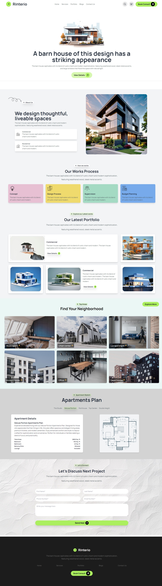

# HomeNest

**HomeNest** is a modern, responsive web page for real estate purposes. It’s designed to showcase housing listings and provide essential real estate services in an engaging and user-friendly format. Whether you’re looking to buy, rent, or explore housing options, HomeNest offers a streamlined experience.

## Features
- **Responsive Design**: Adapts seamlessly to various screen sizes, ensuring an optimal viewing experience on desktops, tablets, and smartphones.
- **Intuitive Navigation**: Easy-to-use interface that allows users to browse and search for properties with minimal effort.
- **Interactive Elements**: Engaging UI components that enhance user interaction and experience.
- **High-Quality Listings**: Detailed property listings with essential information and visuals.

## Technologies Used
- **Tailwind CSS**: A utility-first CSS framework for creating custom designs efficiently. Tailwind CSS enables rapid development with a focus on responsive and adaptive design.
- **DaisyUI**: A collection of accessible, reusable UI components that complement Tailwind CSS, providing ready-to-use design elements for a polished look.

## Getting Started

1. **Clone the Repository**
   ```bash
   git clone https://github.com/NajibHossain49/HomeNest-.git
   ```

2. **Navigate to the Project Directory**
   ```bash
   cd HomeNest
   ```


## Contributing
Contributions are welcome! Please open issues, submit pull requests, or provide feedback.


### Connect with Me

- [GitHub](https://github.com/NajibHossain49)
- [LinkedIn](https://www.linkedin.com/in/md-najib-hossain/)

---



